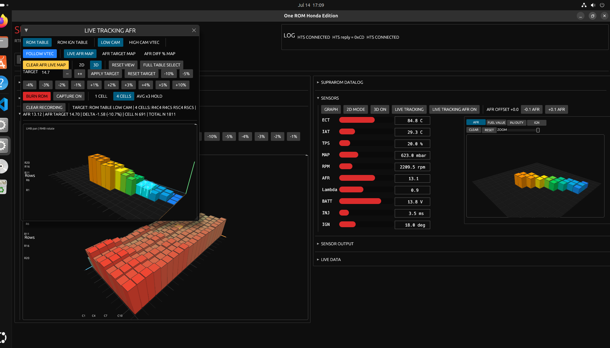
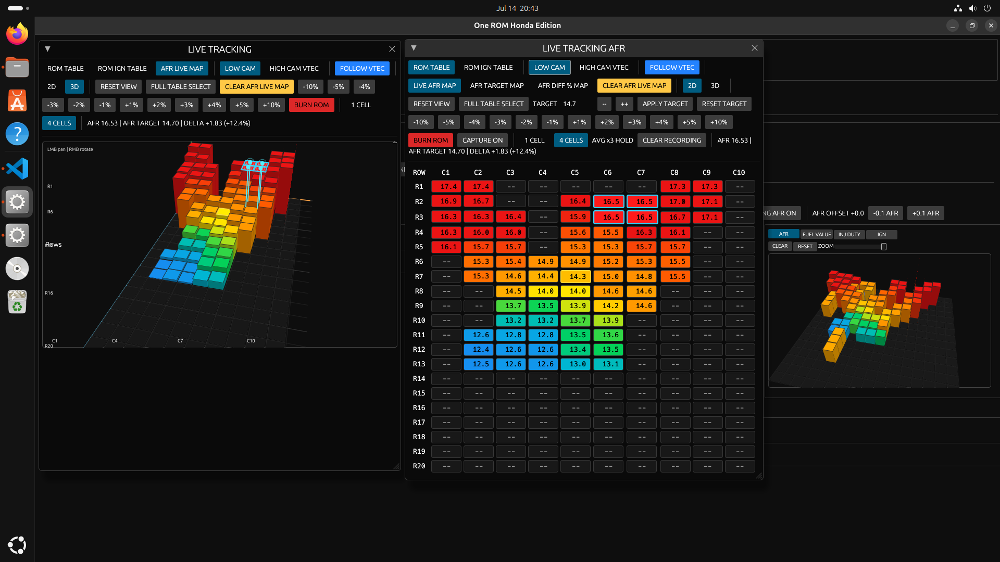

# HONDA-ONEROM-EDITOR

Version minimale 

## Contenu

- minimal-run/onerom-honda-edition
	- binaire Linux x86_64 pret a executer
- minimal-build/
	- strict minimum des sources necessaires pour recompiler onerom-honda-edition

## Execution Linux directe

./minimal-run/onerom-honda-edition

## Recompiler depuis les sources minimales

cargo build --release --manifest-path minimal-build/docs/Cargo.toml

Binaire genere:

minimal-build/docs/target/release/onerom-honda-edition

## Generer le .exe Windows

Script inclus:

scripts/build-windows-exe.sh

Il fait automatiquement:
- installation de la target Rust Windows GNU (via rustup)
- build release de l'app pour `x86_64-pc-windows-gnu`
- copie du binaire final vers `minimal-run/onerom-honda-edition.exe`
- copie des DLL runtime MinGW dans `minimal-run/` (double-clic direct sous Windows)

Pre-requis Linux (Ubuntu/Debian):

sudo apt update
sudo apt install -y mingw-w64

Execution:

./scripts/build-windows-exe.sh

Resultat:

minimal-run/onerom-honda-edition.exe

Pour lancer sur Windows:
- ouvrir le dossier `minimal-run`
- double-cliquer `onerom-honda-edition.exe`

## Notes

- Cette version retire le gros snapshot precedent.
- Seuls les sous-dossiers Rust necessaires au build sont conserves:
	- rust/cli
	- rust/config
	- rust/fw
	- rust/gen
	- rust/sdrr-fw-parser

## Screens de l'app

